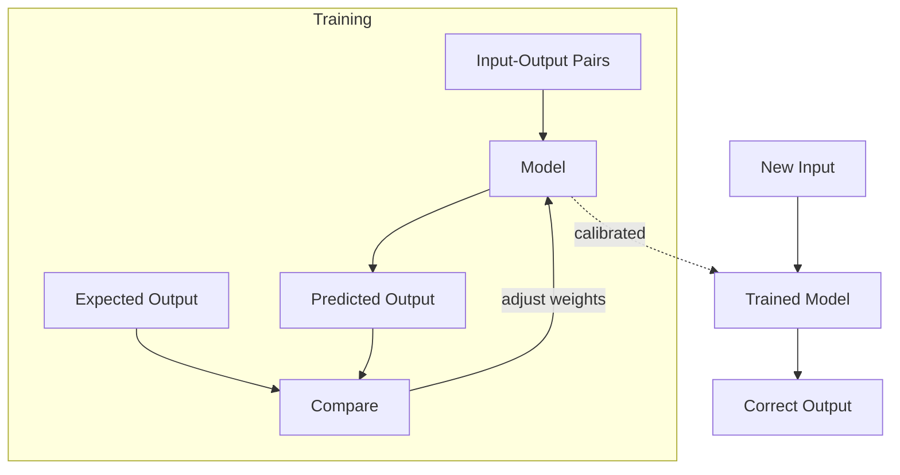

# Introduction — What is ML (Overview Diagram)

Place this in Notion as a code block with language set to `mermaid`.
Insert after the first paragraph ("...correct outputs that we did not previously have.").

